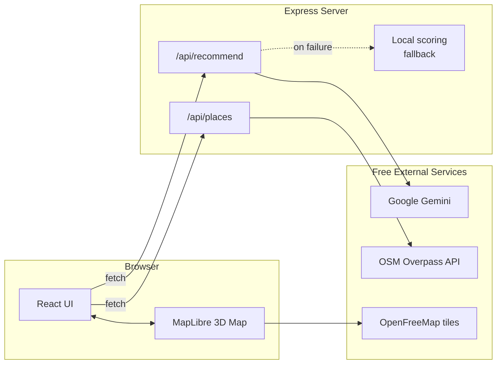

<div align="center">

# 🌆 Pulse Map PDX

### Real-Time, AI-Powered Activity Map for Portland, Oregon

Discover what's actually open, buzzing, and worth visiting right now — on a living 3D map.

[](https://react.dev/)
[](https://www.typescriptlang.org/)
[](https://vitejs.dev/)
[](https://maplibre.org/)
[](https://ai.google.dev/)
[](https://www.openstreetmap.org/)
[](#license)

</div>

---

## ✨ What is this?

**Pulse Map PDX** is a Snapchat-style, real-time activity discovery map centered on Portland, Oregon. It blends **live open data**, an **interactive 3D map**, and **generative AI** into one dashboard:

- 🗺️ A **3D vector map** (MapLibre GL JS) with day/night themes and colorful, cartoon-style extruded buildings
- 📍 **Real venues** — restaurants, bars, gyms, coworking spaces, markets — pulled live from OpenStreetMap around a configurable center point
- 🤖 **AI-personalized recommendations** from Google Gemini, grounded in the actual candidate venues (never invented places), with a deterministic local fallback if the AI is unavailable
- 🎛️ **Rich, scrollable filters** — mood, category, cuisine, budget, group size, distance, time-of-day, and sort order
- 👤 **Persona-driven UX** — pick or customize a "Portlander" persona that shapes recommendations
- 📱 **Fully responsive** — from phone to ultrawide desktop

> ⚠️ **Honesty note:** Names, coordinates, addresses, categories, and opening hours (where tagged) are **real**, sourced from OpenStreetMap. Star ratings and "active users" counts are a **simulated visual flourish** — no free public API provides real-time foot traffic or crowd-sourced ratings, so these stay clearly documented as fake in the code.

---

## 🖼️ Core Experience

| Area | What it does |
|---|---|
| **Left sidebar** | Persona banner, live-data indicator, filter dropdowns, AI recommendation trigger, and the scrollable results feed |
| **Right panel** | The 3D map — tap a pin to see details, check in, and center the camera on it |
| **Header** | Simulated/real-time clock, persona quick-switch, active-user pulse counter, reset button |

---

## 🧱 Tech Stack

| Layer | Technology | Why |
|---|---|---|
| UI | **React 19** + **TypeScript** | Type-safe, component-driven dashboard UI |
| Styling | **Tailwind CSS v4** | Fast utility-first styling, dark-mode-first design |
| Build tool | **Vite 6** | Instant HMR, fast builds |
| Map engine | **MapLibre GL JS** | Free, open-source vector maps with native 3D building extrusion |
| Map tiles | **OpenFreeMap** | Free vector tiles, no API key, day & night styles |
| Live place data | **OpenStreetMap Overpass API** | Free, real venue data — no billing setup required |
| Backend | **Node.js + Express** | Thin API layer; proxies AI calls so keys never reach the browser |
| AI | **Google Gemini** (`gemini-3.6-flash`) | Structured JSON-mode recommendations grounded in real candidate data |
| Icons / motion | **lucide-react**, **Framer Motion** | Iconography and micro-interactions |

---

## 🏗️ Architecture



---

## 🚀 Getting Started

### Prerequisites
- **Node.js** 18+ and npm

### 1. Clone & install
```bash
git clone https://github.com/Abdul-Zahid01/Pulse-map-AI.git
cd Pulse-map-AI
npm install
```

### 2. Configure environment
Create a `.env` file in the project root (never commit this):
```env
GEMINI_API_KEY="your-gemini-api-key"
APP_URL="http://localhost:3000"
```
> Don't have a key? Get a free one at [Google AI Studio](https://aistudio.google.com/apikey). The app works fine without it too — it automatically falls back to a local recommendation algorithm.

### 3. Run in development
```bash
npm run dev
```
Visit **http://localhost:3000**.

### 4. Build for production
```bash
npm run build
npm run start
```

---

## 📁 Project Structure

```
├── server.ts                    # Express server: /api/health, /api/places, /api/recommend
├── src/
│   ├── App.tsx                  # App state, filtering/sorting logic
│   ├── types.ts                 # Shared TypeScript types
│   ├── components/
│   │   ├── MapView.tsx          # MapLibre 3D map, markers, day/night themes
│   │   ├── SidebarControls.tsx  # Scrollable filter dropdowns
│   │   ├── FilterDropdown.tsx   # Reusable single/multi-select dropdown
│   │   ├── ActivityCardList.tsx # Filtered results feed
│   │   ├── AIRecommendationsCard.tsx
│   │   ├── PersonaBanner.tsx / PersonaModal.tsx
│   │   ├── ActivityModal.tsx    # Venue detail + check-in
│   │   └── Header.tsx
│   ├── data/
│   │   ├── realPlaces.ts        # Live Overpass fetch, transform, cache
│   │   └── pdxActivities.ts     # Static demo fallback dataset
│   └── utils/
│       └── geo.ts               # Haversine distance, center point
```

---

## 🔍 Notable Engineering Details

- **Graceful degradation everywhere** — if live map data fails to fetch, the app falls back to a bundled demo dataset; if Gemini is unreachable, it falls back to a deterministic scoring algorithm. The UI never breaks.
- **Server-side data shaping** — real venues are capped per category and filtered by an allow-list of cuisines *before* they ever reach the browser, keeping the map fast and uncluttered.
- **AI grounding, not hallucination** — Gemini only ranks/selects from the real candidate venues it's given; it can't invent places.
- **API keys stay server-side** — all AI calls are proxied through the Express backend.

---

## 🗺️ Roadmap Ideas

- [ ] Real events API integration (Eventbrite / Ticketmaster)
- [ ] User accounts & persisted check-ins
- [ ] Configurable search center via UI (not just hardcoded)
- [ ] Real ratings via an official Places API

---

## 📄 License

MIT — free to use, modify, and learn from.

<div align="center">

Built with ☕, 🗺️, and a bit of AI magic in Portland, OR.

</div>
